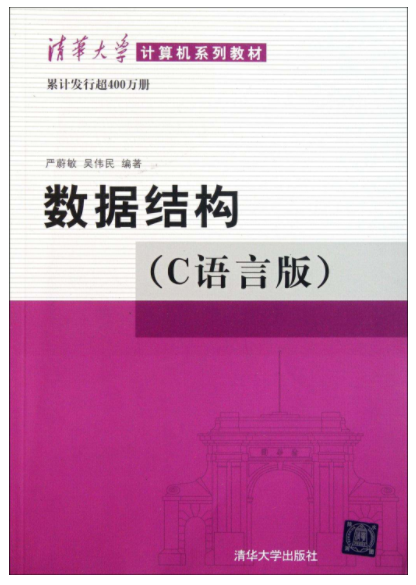

# 数据结构笔记

## 本仓库内容

1. 数据结构基本理论
2. 数据结构相关面试题解析

```
Something I hope you know before go into the coding~
First, please watch or star this repo, I'll be more happy if you follow me.
Bug report, questions and discussion are welcome, you can post an issue or pull a request.
```

## 相关站点

* GitHub地址:<https://github.com/yifengyou/learn-datastructure>

* GibBook地址:<https://yifengyou.gitbooks.io/learn-datastructure/content/>


## 目录

* [绪论](docs/绪论/绪论.md)
* [线性表](docs/线性表/线性表.md)
* [栈和队列](docs/栈和队列/栈和队列.md)
* [串](docs/串/串.md)
* [数组](docs/数组/数组.md)
* [广义表](docs/广义表/广义表.md)
* [树](docs/树/树.md)
    * [二叉树基本概念](docs/树/二叉树基本概念.md)
    * [线索二叉树](docs/树/线索二叉树.md)
    * [树+森林+二叉树的转换](docs/树/树+森林+二叉树的转换.md)
    * [哈弗曼树及其应用](docs/树/哈弗曼树及其应用.md)
    * [算法-二叉排序树](docs/树/算法-二叉排序树.md)
    * [算法-平衡二叉树AVL](docs/树/算法-平衡二叉树AVL.md)
    * [算法-红黑树-*常考必掌握*](docs/树/算法-红黑树.md)
    * [算法-多路查找树](docs/树/算法-多路查找树.md)
* [图](docs/图/图.md)

## 参考博客


## 参考书籍




## 总结

1. 基础永远值得花费90%的精力去学习加强。厚积而薄发~
2. 要理解一个软件系统的真正运行机制，一定要阅读其源代码~
