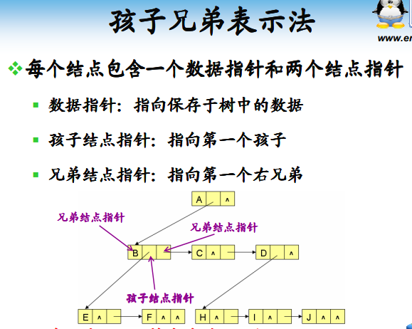
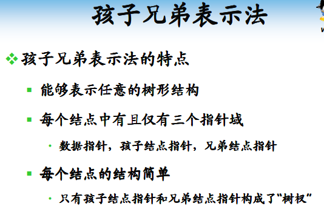
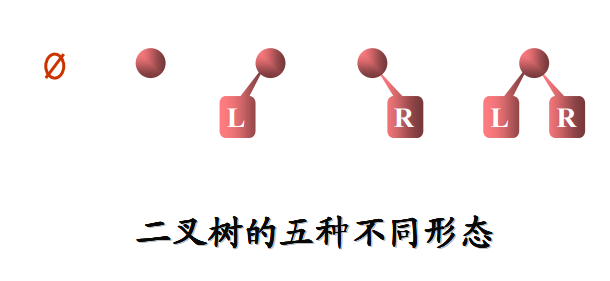
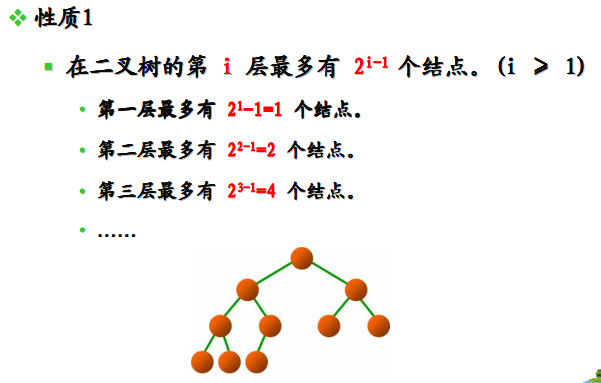
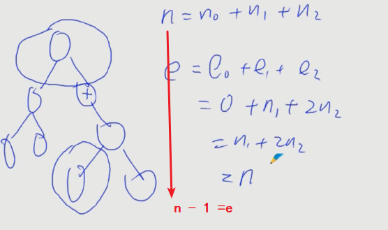
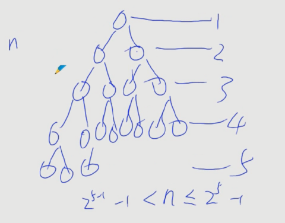
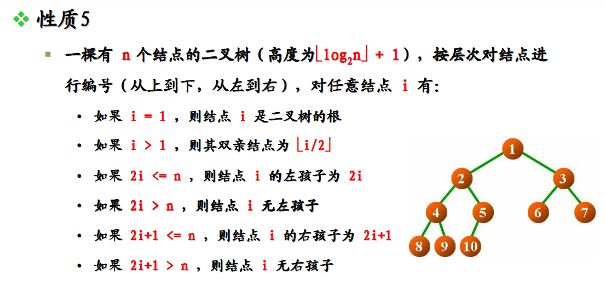

<!-- TOC depthFrom:1 depthTo:6 withLinks:1 updateOnSave:1 orderedList:0 -->

- [二叉树基本概念](#二叉树基本概念)
	- [通用树结构的讨论](#通用树结构的讨论)
		- [双亲孩子表示法](#双亲孩子表示法)
		- [孩子兄弟表示](#孩子兄弟表示)
	- [二叉树概念](#二叉树概念)
	- [满二叉树+完全二叉树](#满二叉树完全二叉树)
	- [二叉树基本性质](#二叉树基本性质)
	- [END](#end)

<!-- /TOC -->
# 二叉树基本概念


## 通用树结构的讨论


### 双亲孩子表示法


### 孩子兄弟表示法


* 用户感觉不到你创建的树





* 只包含三个指针域。类似的双亲孩子表示法

## 二叉树概念


* 本质就是树，但是限制度不超过二，分别称左子树，右子树



## 满二叉树+完全二叉树


* 完全二叉树就是满二叉树从右到左，从下到上挨个删除节点所得到的。


* 满二叉树是特殊的完全二叉树。可特么完全怎么解释这个锤子名字。特么哪里完全了？
* N个节点，完全二叉树高度最小


## 二叉树基本性质




 ```
 对任何非空二叉树T，若n0 表示叶结点的个数、n2 表示度为2 的非叶结点的个数，那么两者满足关系n0 = n2 + 1。

这个性质很有意思，下面我们来证明它。

证明：首先，假设该二叉树有N 个节点，那么它会有多少条边呢？答案是N - 1，这是因为除了根节点，其余的每个节点都有且只有一个父节点，那么这N 个节点恰好为树贡献了N - 1 条边。这是从下往上的思考，而从上往下(从树根到叶节点)的思考，容易得到每个节点的度数和 0*n0 + 1*n1 + 2*n2 即为边的个数。

因此，我们有等式 N - 1 = n1 + 2*n2，把N 用n0 + n1 + n2 替换，得到n0 + n1 + n2 - 1 = n1 + 2*n2，于是有

n0 = n2 + 1。命题得证。

 ```









## END
