<!-- TOC depthFrom:1 depthTo:6 withLinks:1 updateOnSave:1 orderedList:0 -->

- [树](#树)
	- [树的定义](#树的定义)
	- [树家族概念](#树家族概念)
	- [树的一般操作](#树的一般操作)
	- [通用树的存储结构](#通用树的存储结构)
	- [相关代码](#相关代码)
	- [END](#end)

<!-- /TOC -->
# 树

* 非线性数据结构。内存是线性结构，如何在内存中存储？指针

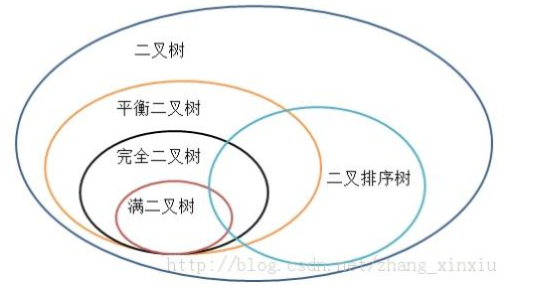

* 树是一种特殊的图，图的存储结构也试用于树

## 树的定义

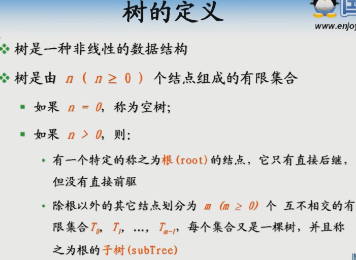

* 由N个节点组成的有限集合。N>=0
  - N=0，**空树**，等同于**空链表**
  - N>0，第一个节点即为**根**，根必须唯一，根的子节点也是**根的子树**
  - 树的定义是**递归定义**，递归出口在遇到空树
* 区别于生活中的树，这是一棵倒插树


## 树家族概念


* **节点的度**，节点所包含子树的个数，```不考虑父节点，只考虑子节点```。
* **树的度**，每个节点子树数目中最大的值就是树的度。认为定义


* **孩子节点**，某个节点的孩子
* **子孙节点**，某节点的孩子的孩子
* **兄弟节点**，有同样的直接父节点
* **叶子节点** = **终端节点**，没有子孙节点的节点，度为0的节点
* **堂兄弟节点**，双亲节点在同一层的子节点。


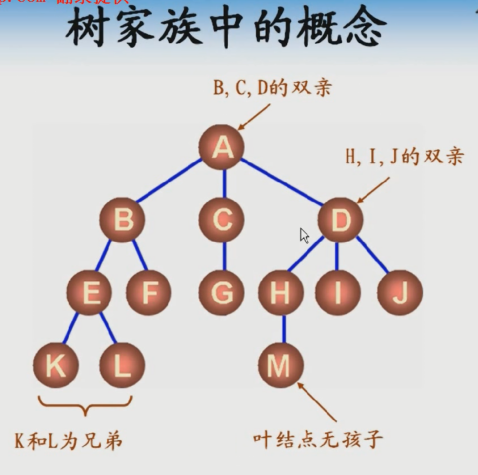

* **树的层次**，根节点就是第一层
* **树的高度**，从根节点到叶子节点所经过的最大层次


* **有序树**，顺序不能互换，位置唯一

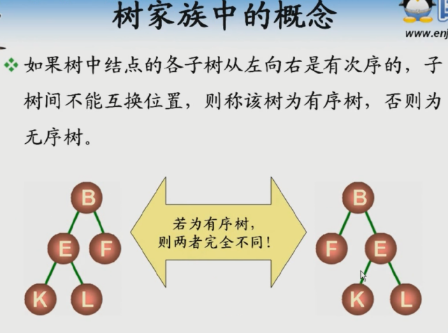

* **森林**，N棵树组成森林，但是不能有交集

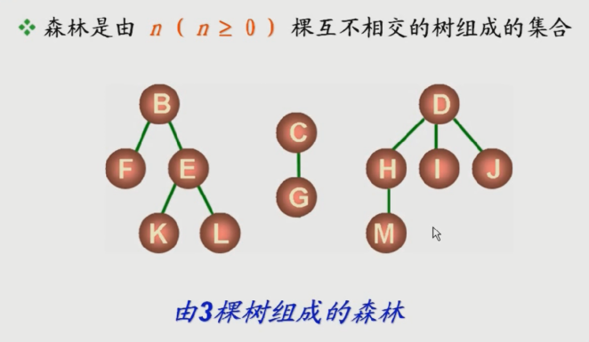


## 树的一般操作


## 通用树的存储结构

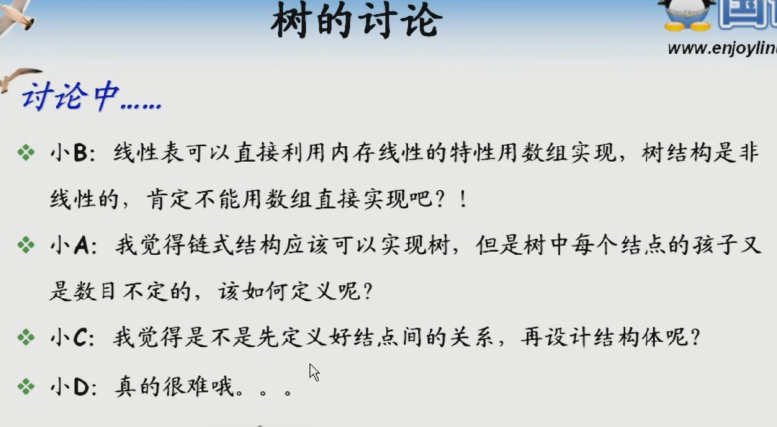

* 如果用结构体数组？

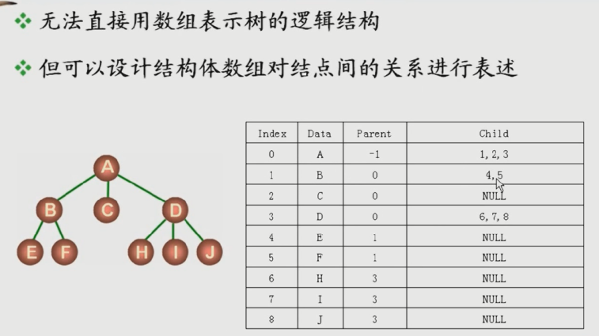

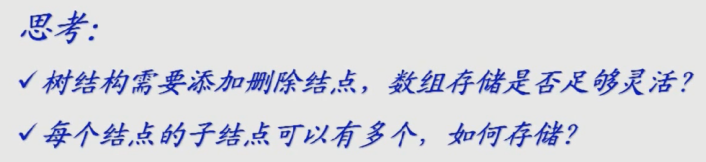

* 如果用链表存储树

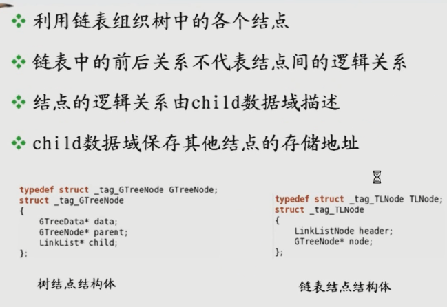


* 除了根节点，其他节点都有双亲


* 树的子节点没有顺序关系因此可以把子节点串成链表


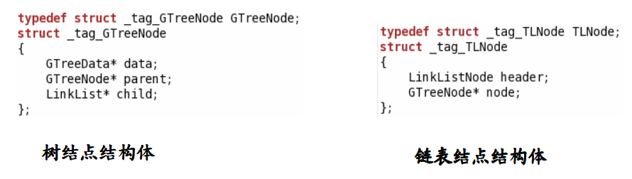

* 双亲存储结构-树的顺序存储结构
* 孩子存储结构-链表存储

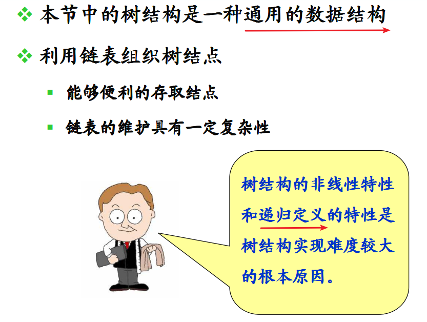


## 相关代码

```
  #include <stdio.h>
  #include <malloc.h>
  #include "GTree.h"
  #include "LinkList.h"


typedef struct _tag_GTreeNode GTreeNode;
struct _tag_GTreeNode
{
    GTreeData* data;
    GTreeNode* parent;
    LinkList* child;
};


typedef struct _tag_TLNode TLNode;
struct _tag_TLNode
{
    LinkListNode header;
    GTreeNode* node;
};


static void recursive_display(GTreeNode* node, GTree_Printf* pFunc, int format, int gap, char div)
{
    int i = 0;

    if( (node != NULL) && (pFunc != NULL) )
    {
        for(i=0; i<format; i++)
        {
            printf("%c", div);
        }

        pFunc(node->data);

        printf("\n");

        for(i=0; i<LinkList_Length(node->child); i++)
        {
            TLNode* trNode = (TLNode*)LinkList_Get(node->child, i);

            recursive_display(trNode->node, pFunc, format + gap, gap, div);
        }
    }
}

static void recursive_delete(LinkList* list, GTreeNode* node)
{
    if( (list != NULL) && (node != NULL) )
    {
        GTreeNode* parent = node->parent;
        int index = -1;
        int i = 0;

        for(i=0; i<LinkList_Length(list); i++)
        {
            TLNode* trNode = (TLNode*)LinkList_Get(list, i);

            if( trNode->node == node )
            {
                LinkList_Delete(list, i);

                free(trNode);

                index = i;

                break;
            }
        }

        if( index >= 0 )
        {  
            if( parent != NULL )
            {
                 for(i=0; i<LinkList_Length(parent->child); i++)
                 {
                     TLNode* trNode = (TLNode*)LinkList_Get(parent->child, i);

                     if( trNode->node == node )
                     {
                         LinkList_Delete(parent->child, i);

                         free(trNode);

                         break;
                     }
                 }               
            }

            while( LinkList_Length(node->child) > 0 )
            {
                TLNode* trNode = (TLNode*)LinkList_Get(node->child, 0);

                recursive_delete(list, trNode->node);
            }

            LinkList_Destroy(node->child);

            free(node);
        }
    }
}

static int recursive_height(GTreeNode* node)
{
    int ret = 0;

    if( node != NULL )
    {
        int subHeight = 0;
        int i = 0;

        for(i=0; i<LinkList_Length(node->child); i++)
        {
            TLNode* trNode = (TLNode*)LinkList_Get(node->child, i);

            subHeight = recursive_height(trNode->node);

            if( ret < subHeight )
            {
                ret = subHeight;
            }
        }

        ret = ret + 1;
    }

    return ret;
}

static int recursive_degree(GTreeNode* node)
{
int ret = -1;

    if( node != NULL )
    {
        int subDegree = 0;
        int i = 0;

        ret = LinkList_Length(node->child);

        for(i=0; i<LinkList_Length(node->child); i++)
        {
            TLNode* trNode = (TLNode*)LinkList_Get(node->child, i);

            subDegree = recursive_degree(trNode->node);

            if( ret < subDegree )
            {
                ret = subDegree;
            }
        }
    }

    return ret;
}

GTree* GTree_Create()
{
    return LinkList_Create();
}

void GTree_Destroy(GTree* tree)
{
    GTree_Clear(tree);
    LinkList_Destroy(tree);
}

void GTree_Clear(GTree* tree)
{
     GTree_Delete(tree, 0);
}

int GTree_Insert(GTree* tree, GTreeData* data, int pPos)
{
    LinkList* list = (LinkList*)tree;
    int ret = (list != NULL) && (data != NULL) && (pPos < LinkList_Length(list));

    if( ret )
    {
        TLNode* trNode = (TLNode*)malloc(sizeof(TLNode));
        TLNode* cldNode = (TLNode*)malloc(sizeof(TLNode));
        TLNode* pNode = (TLNode*)LinkList_Get(list, pPos);
        GTreeNode* cNode = (GTreeNode*)malloc(sizeof(GTreeNode));

        ret = (trNode != NULL) && (cldNode != NULL) && (cNode != NULL);

        if( ret )
        {
            cNode->data = data;
            cNode->parent = NULL;
            cNode->child = LinkList_Create();

            trNode->node = cNode;
            cldNode->node = cNode;

            LinkList_Insert(list, (LinkListNode*)trNode, LinkList_Length(list));

            if( pNode != NULL )
            {
                cNode->parent = pNode->node;

                LinkList_Insert(pNode->node->child, (LinkListNode*)cldNode, LinkList_Length(pNode->node->child));
            }
        }
        else
        {
            free(trNode);
            free(cldNode);
            free(cNode);
        }
    }

    return ret;
}

GTreeData* GTree_Delete(GTree* tree, int pos)
{
    TLNode* trNode = (TLNode*)LinkList_Get(tree, pos);
    GTreeData* ret = NULL;

    if( trNode != NULL )
    {
        ret = trNode->node->data;

        recursive_delete(tree, trNode->node);
    }

    return ret;
}

GTreeData* GTree_Get(GTree* tree, int pos)
{
    TLNode* trNode = (TLNode*)LinkList_Get(tree, pos);
    GTreeData* ret = NULL;

    if( trNode != NULL )
    {
        ret = trNode->node->data;
    }

    return ret;
}

GTreeData* GTree_Root(GTree* tree)
{
    return GTree_Get(tree, 0);
}

int GTree_Height(GTree* tree)
{
    TLNode* trNode = (TLNode*)LinkList_Get(tree, 0);
    int ret = 0;

    if( trNode != NULL )
    {
        ret = recursive_height(trNode->node);
    }

    return ret;
}

int GTree_Count(GTree* tree)
{
    return LinkList_Length(tree);
}

int GTree_Degree(GTree* tree)
{
    TLNode* trNode = (TLNode*)LinkList_Get(tree, 0);
    int ret = -1;

    if( trNode != NULL )
    {
        ret = recursive_degree(trNode->node);
    }

    return ret;
}

void GTree_Display(GTree* tree, GTree_Printf* pFunc, int gap, char div)
{
    TLNode* trNode = (TLNode*)LinkList_Get(tree, 0);

    if( (trNode != NULL) && (pFunc != NULL) )
    {  
        recursive_display(trNode->node, pFunc, 0, gap, div);
    }
}


```


## END
