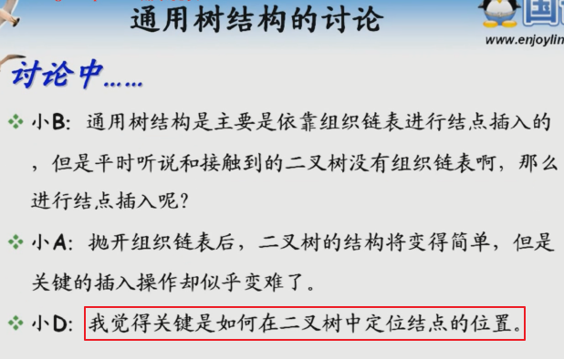
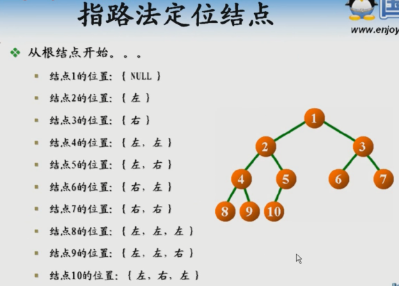
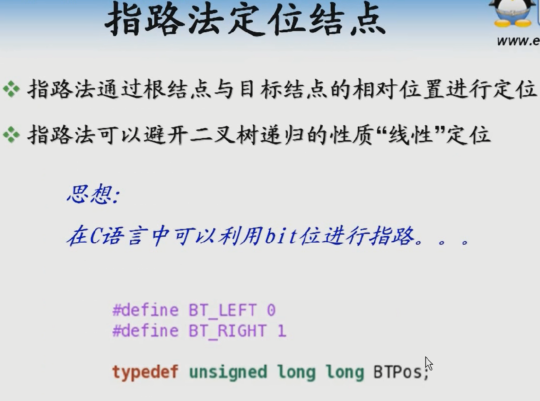
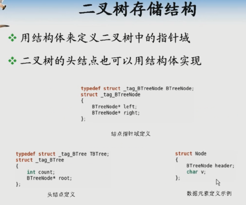
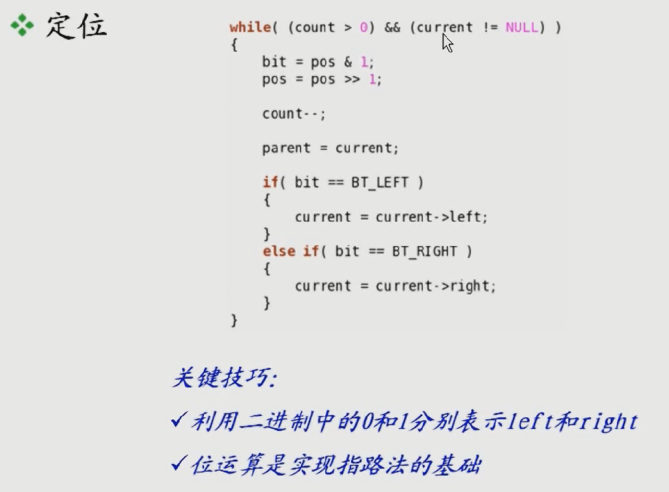
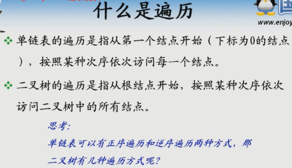
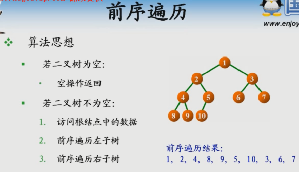
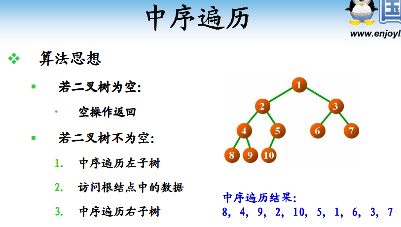
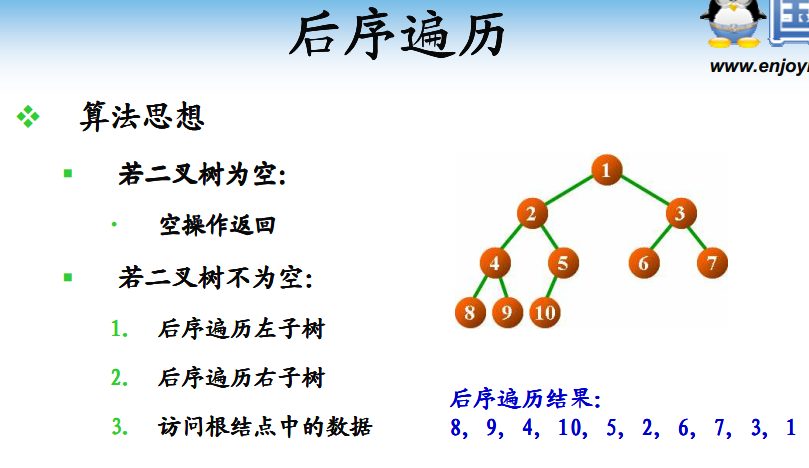
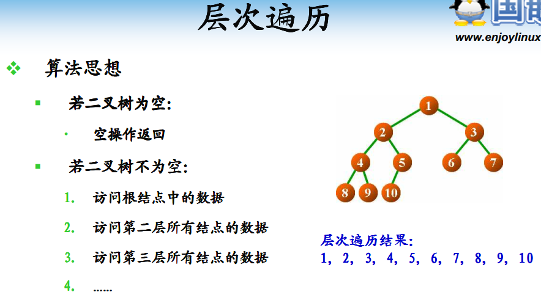

# 二叉树基本操作

## 通用树结构讨论








* 如何定位某个节点？如何找到路径？递归

## 二叉树存储结构

### 创建+插入节点





* 指路发，把非线性的用线性排列


### 遍历












## 代码

```
  #include <iostream>
  using namespace std;

//定义二叉树结构
typedef struct Node
{
    char data;
    struct Node *lchild,*rchild;
}*BiTree,BiTNode;

//先序创建二叉树,递归创建,'#'表示空,节点为空
//先创建后递归,递归出口在哪里？
void CreateBiTree(BiTree &T)
{
    char ch;
    cin>>ch;
    if(ch=='#'){
      T=NULL;
    }
    else{
        T=new BiTNode;
        T->data=ch;
        CreateBiTree(T->lchild);
        CreateBiTree(T->rchild);
    }
}

//中序遍历
void InOrderTraverse(BiTree T)
{
    if(T)
    {
        InOrderTraverse(T->lchild);
        cout<<T->data;
        InOrderTraverse(T->rchild);
    }
}
//先序遍历
void PreOrderTraverse(BiTree T)
{
    if(T)
    {
        cout<<T->data;
        PreOrderTraverse(T->lchild);
        PreOrderTraverse(T->rchild);
    }
}
//后序遍历
void PostOrderTraverse(BiTree T)
{
    if(T)
    {
        PostOrderTraverse(T->lchild);
        PostOrderTraverse(T->rchild);
        cout<<T->data;
    }
}

//二叉树的复制
void Copy(BiTree T,BiTree &NewT)
{
    if(T==NULL){
        NewT=NULL;
        return;
    }else
    {
        NewT=new BiTNode;
        NewT->data=T->data;
        Copy(T->lchild,NewT->lchild);
        Copy(T->rchild,NewT->rchild);
    }
}

//树的深度
int Depth(BiTree T)
{
    if(T==NULL){
        return 0;
    }
    else
    {
        int m=Depth(T->lchild);
        int n=Depth(T->rchild);
        if(m>n){
          return (m+1);
        }else{
          return (n+1);
        }
    }
}

//统计二叉树中结点的个数
int NodeCount(BiTree T)
{
    if(T==NULL)
      return 0;
    else
      return NodeCount(T->lchild)+NodeCount(T->rchild)+1;
}

int LeafCount(BiTree T)
{//统计二叉树中叶子结点的个数
    if(!T)
      return 0;
    if(!T->lchild &&!T->rchild){//如果二叉树左子树和右子树皆为空,说明该二叉树根节点为叶子节点,加1.
        return 1;
    }else{
        return LeafCount(T->lchild)+LeafCount(T->rchild);
    }
}

//统计二叉树的度为1的结点个数
int Node_1_Count(BiTree T)
{
    if(!T) return 0;
    if((!T->lchild)&&(T->rchild)||(T->lchild)&&(!T->rchild))
        return 1;
    else
        return Node_1_Count(T->lchild)+Node_1_Count(T->rchild);
}

//二叉树中从每个叶子结点到根结点的路径
void PrintAllPath(BiTree T, char path[], int pathlen)
{
  int i;
  if(T != NULL) {
    path[pathlen] = T->data; //将当前结点放入路径中
    if(T->lchild == NULL && T->rchild == NULL) {//叶子结点
        for(i = pathlen; i >= 0; i--)
            cout << path[i] << " " ;
      cout << endl;
    }else{
      PrintAllPath(T->lchild, path, pathlen + 1);
      PrintAllPath(T->rchild, path, pathlen + 1);
    }
  }
}

//构造函数，使用递归算法进行左右结点转换
void ExChangeTree(BiTree &T)
{
    BiTree temp;
    if(T!=NULL){//判断T是否为空，非空进行转换，否则不转换
        temp=T->lchild;
        T->lchild=T->rchild;//直接交换节点地址
        T->rchild=temp;
        ExChangeTree(T->lchild);
        ExChangeTree(T->rchild);
    }
}
//二叉树的双序遍历 - 没啥锤子用
void DblOrderTraverse(BiTree T)
{
    if(T)
    {
        cout<<T->data;
        DblOrderTraverse(T->lchild);
        cout<<T->data;//访问两遍
        DblOrderTraverse(T->rchild);
    }
}
int main()
{
    BiTree T;
    //测试例子AB#CD##E##F#GH###
    cout<<"先序遍历输入(以#结束):";
    CreateBiTree(T);
    cout<<"中序遍历输出:";
    InOrderTraverse(T);
    cout<<endl<<"先序遍历输出:";
    PreOrderTraverse(T);
    cout<<endl<<"后序遍历输出:";
    PostOrderTraverse(T);
    cout<<endl<<"树的深度:"<<Depth(T);
    cout<<endl<<"结点的个数:"<<NodeCount(T);
    cout<<endl<<"叶结点的个数:"<<LeafCount(T);
    cout<<endl<<"度为1的结点个数:"<<Node_1_Count(T);
    cout<<endl<<"二叉树中从每个叶子结点到根结点的所有路径："<<endl;
    char path[256];
    int pathlen=0;
    PrintAllPath(T,path,pathlen);//
    //交换二叉树每个结点的左孩子和右孩子
    BiTree tem=T;//直接复制一颗树，在不改变原树的前提下，对临时树进行交换。
    ExChangeTree(tem);
    cout<<"先序遍历输出交换后的结果:";
    PreOrderTraverse(tem);
    cout<<endl<<"双序遍历输出:";
    DblOrderTraverse(T);
    return 0;
}
```


## 总结

* 不懂递归，不懂二叉树


## END
