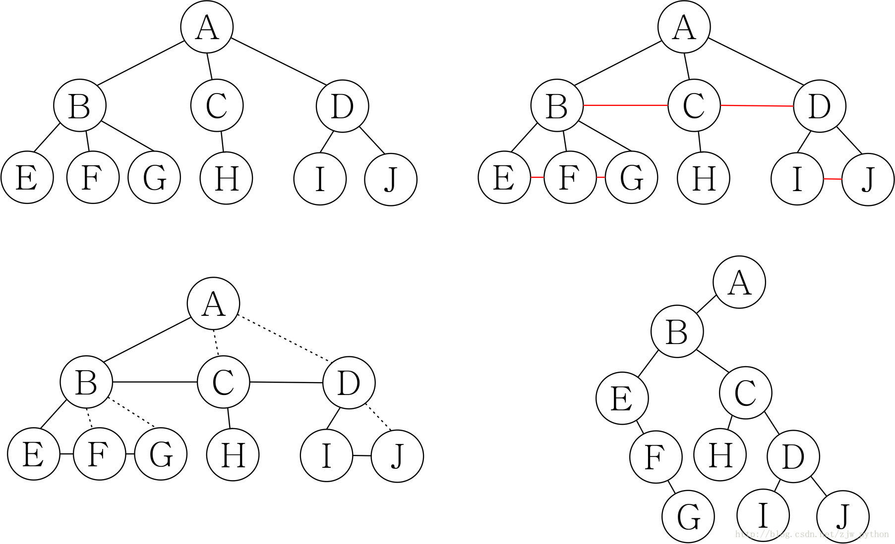
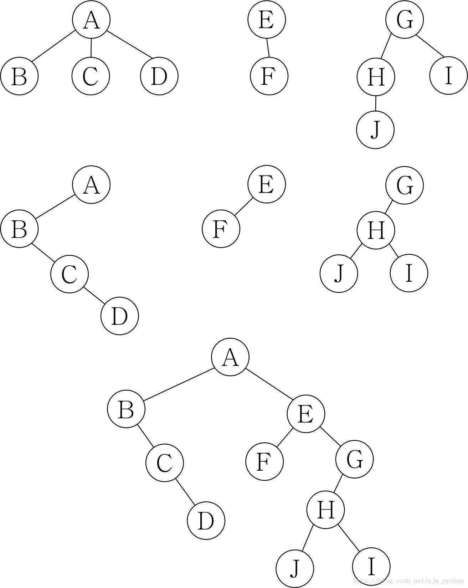

# 树+森林+二叉树的转换

## 树转换为二叉树
```
将树转换为二叉树的步骤如下：
1. 加线。在所有相邻的兄弟结点之间加一条线。
2. 去线。对树中的每个结点。只保留它与第一个孩子结点的连线，删除它与其他孩子结点之间的连线。
3. 层次调整。原来结点第一个孩子是二叉树结点的左孩子，兄弟转换过来的孩子是结点的右孩子。
```



## 森林转换为二叉树

```
将森林转换为二叉树的步骤如下：
1. 把每棵树都转换为二叉树。
2. 第一棵二叉树不动，从第二棵二叉树开始，依次把后一棵二叉树的根结点作为前一棵二叉树根结点的右孩子，用线连接起来。当所有二叉树连接起来后就得到了由森林转换来的二叉树。
```




## END
