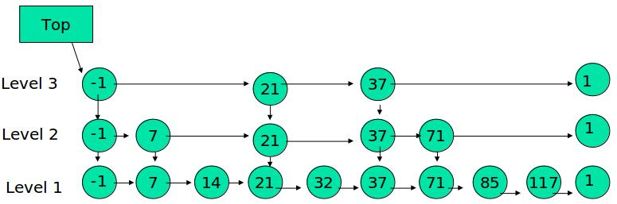

<!-- TOC depthFrom:1 depthTo:6 withLinks:1 updateOnSave:1 orderedList:0 -->

- [算法-跳表](#算法-跳表)
	- [有序表的搜索到跳表的引入](#有序表的搜索到跳表的引入)
	- [跳表](#跳表)
	- [跳表的搜索](#跳表的搜索)
	- [跳表的插入](#跳表的插入)
	- [跳表的删除](#跳表的删除)
	- [几何分布的期望](#几何分布的期望)
	- [跳表的高度](#跳表的高度)
	- [丢硬币决定 K](#丢硬币决定-k)
	- [跳表的高度](#跳表的高度)
	- [跳表的空间复杂度分析](#跳表的空间复杂度分析)
	- [插入与删除的时间复杂度分析O(logn)](#插入与删除的时间复杂度分析ologn)
	- [总结](#总结)
	- [参考博客](#参考博客)
	- [END](#end)

<!-- /TOC -->
# 算法-跳表


## 有序表的搜索到跳表的引入

考虑一个有序表：


从该有序表中搜索元素 < 23, 43, 59 > ，需要比较的次数分别为 < 2, 4, 6 >，总共比较的次数

为 2 + 4 + 6 = 12 次。有没有优化的算法吗?  链表是有序的，但不能使用二分查找。类似二叉

搜索树，我们把一些节点提取出来，作为索引。得到如下结构


这里我们把 < 14, 34, 50, 72 > 提取出来作为一级索引，这样搜索的时候就可以减少比较次数了。

 我们还可以再从一级索引提取一些元素出来，作为二级索引，变成如下结构：


这里元素不多，体现不出优势，如果元素足够多，这种索引结构就能体现出优势来了。


## 跳表

下面的结构是就是跳表：

 其中 -1 表示 INT_MIN， 链表的最小值，1 表示 INT_MAX，链表的最大值。



跳表具有如下性质：

(1) 由很多层结构组成

(2) 每一层都是一个有序的链表

(3) 最底层(Level 1)的链表包含所有元素

(4) 如果一个元素出现在 Level i 的链表中，则它在 Level i 之下的链表也都会出现。

(5) 每个节点包含两个指针，一个指向同一链表中的下一个元素，一个指向下面一层的元素。


## 跳表的搜索


例子：查找元素 117

(1) 比较 21， 比 21 大，往后面找

(2) 比较 37,   比 37大，比链表最大值小，从 37 的下面一层开始找

(3) 比较 71,  比 71 大，比链表最大值小，从 71 的下面一层开始找

(4) 比较 85， 比 85 大，从后面找

(5) 比较 117， 等于 117， 找到了节点。

## 跳表的插入

先确定该元素要占据的层数 K（采用丢硬币的方式，这完全是随机的）

然后在 Level 1 ... Level K 各个层的链表都插入元素。

例子：插入 119， K = 2


如果 K 大于链表的层数，则要添加新的层。

例子：插入 119， K = 4


## 跳表的删除

在各个层中找到包含 x 的节点，使用标准的 delete from list 方法删除该节点。

例子：删除 71


## 几何分布的期望

几何分布的分布列


**几何分布就是前n次都没有抽中，第n+1次抽中的概率**

其中

* x表示第x次抽中
* p表示第中的概率

对于每一次抽奖：中奖概率p为3/4，不中奖概率(1-p)为1/4；

假设，对于每一次抽奖，抽中的概率为p，未抽中的概率为(1-p)；

则期望为1/p;

一维离散性概率分布的期望计算公式为：


研究生入学考试重点内容，这~~看懂理解就好办。

女盆友跟我讲，期望就当平均值对待。辣么这个几何分布的平均值是啥意思？n次每中奖，n+1次中奖的可能性

## 跳表的高度

n 个元素的跳表，每个元素插入的时候都要做一次实验，用来决定元素占据的层数 K，

跳表的高度等于这 n 次实验中产生的最大 K


## 丢硬币决定 K

插入元素的时候，元素所占有的层数完全是随机的，通过一下随机算法产生：

```
int random_level()
{
    K = 1;

    while (random(0,1))
        K++;

    return K;
}
```
相当与做一次丢硬币的实验，如果遇到正面，继续丢，遇到反面，则停止，

用实验中丢硬币的次数 K 作为元素占有的层数。显然随机变量 K 满足参数为 p = 1/2 的几何分布，


**K 的期望值 E[K] = 1/p = 2. 就是说，各个元素的层数，期望值是 2 层。**

## 跳表的高度

对每层来说，它会向上增长的概率为1/2，则第m层向上增长的概率为1/2m；

n个元素，则在m层元素数目的期待为Em = n/2m；

当Em = 1，m = log2n即为层数的期待。故其高度期待为 Eh = O(log n)。

## 跳表的空间复杂度分析

根据上面的分析，每个元素的期望高度为 2， 一个大小为 n 的跳表，其节点数目的

期望值是 2n。

**空间复杂度 O(n)**

```
对于每层的期待：第一层n，第二层n/2，第三层n/22，...，直到 n/2log n=1。所以，总空间需求：

S = n + n/2 + n/22 + ... + n/2log n < n(1 + 1/2 + 1/22 + ... + 1/2∞) =2n
```

因此他的空间复杂度为 2n = O(n)

## 插入与删除的时间复杂度分析O(logn)

插入和删除都由查找和更新两部分构成。查找的时间复杂度为O(logn)，更新部分的复杂度又与跳跃表的高度成正比，即也为O(logn)。

所以，插入和删除操作的时间复杂度都为**O(logn)**

最后，概率因子一般用1/2或1/e

## 总结


## 参考博客

<http://kenby.iteye.com/blog/1187303>

## END
